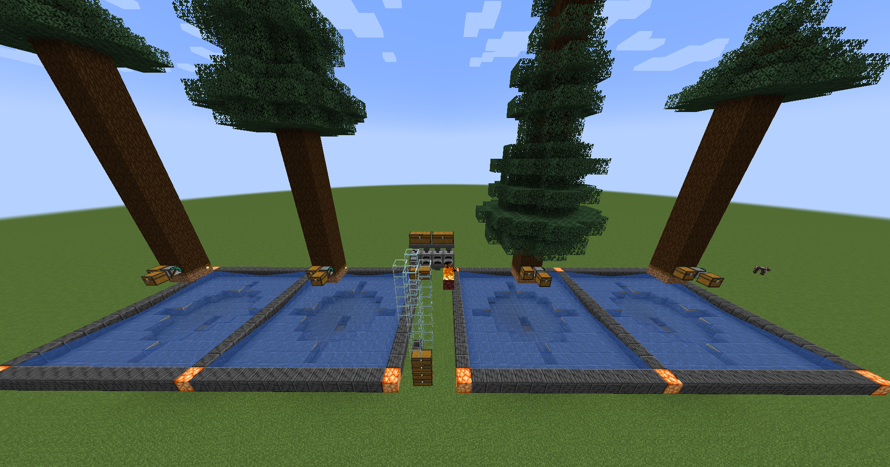
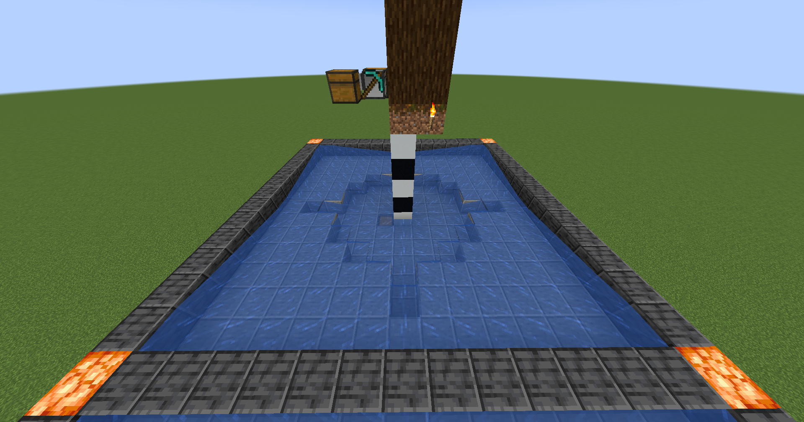
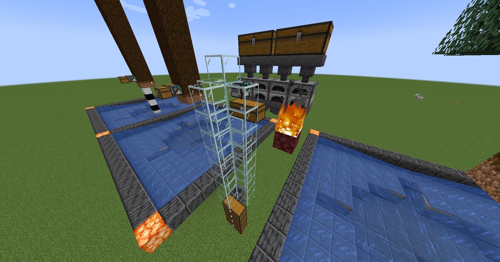

# Charcoal Factory

Creates unlimited amounts of charcoal by farming spruce trees.

## Setup

> [!WARNING]
> It goes without saying, but you must follow this setup found in the screenshots below for the program to work.

### Reference 1
The design uses multiple water collection systems for the saplings to be collected. This allows the lumberjack turtles to keep replanting.

### Reference 2
Each water system has its corresponding tree and lumberjack turtle. Beneath the pillar of white and black concrete, there is a hopper to collect the saplings. The turtles here should use the pastebin code `vvHgqULh`.

### Reference 3
The smelting area is also simple with just eight furnaces and a drop chute for the charcoal. The fire is for surplus saplings and unnecessary sticks. The turtle here should use the pastebin code `hRiARA8v`.

## Lumber.lua

If there is a chest to put saplings in and a chest to pick up charcoal from, this program has the turtle mine trees indefinitely. It will restock saplings.

## Smelter.lua

This program will allow a turtle to collect the logs from the lumberjack turtles and convert the spruce wood into charcoal. It will burn surplus saplings and unnecessary sticks, and it will drop charcoal into the drop chute.
