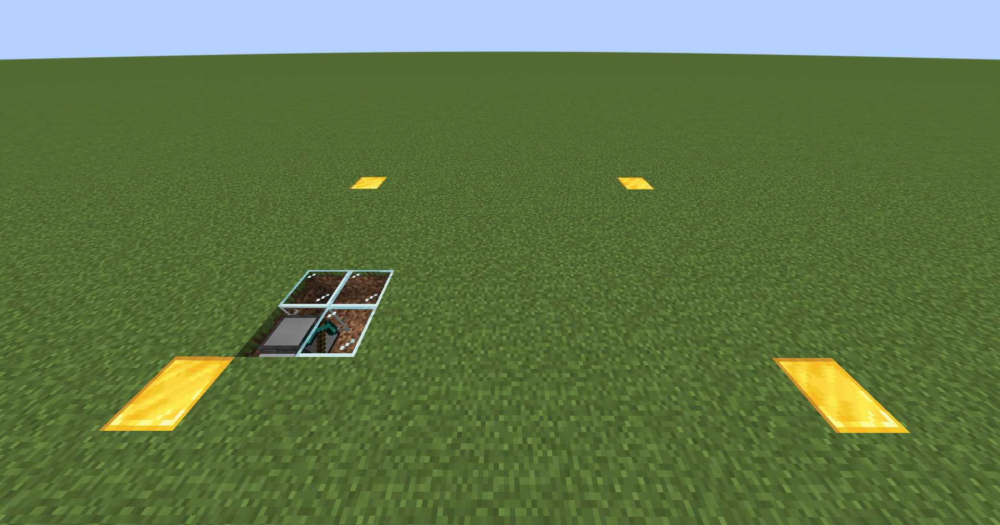
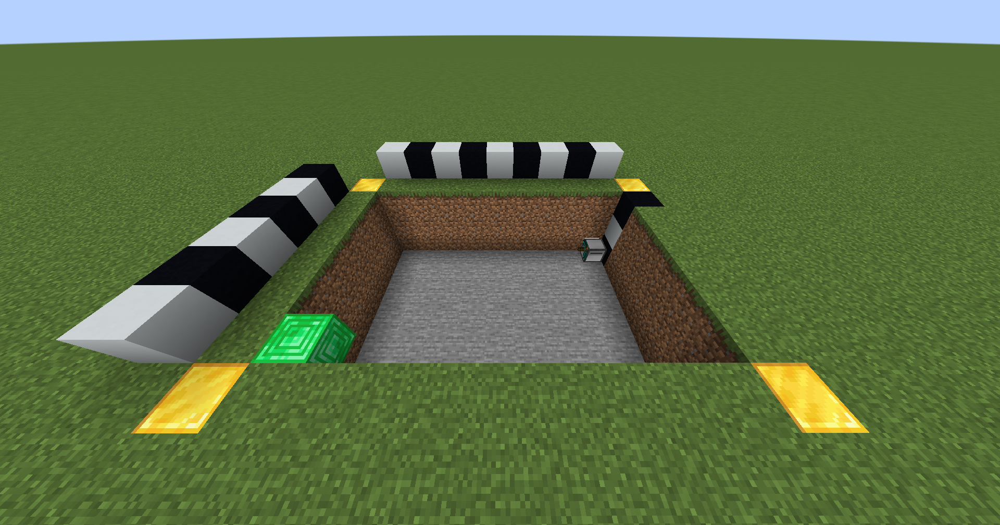

# Quarry
Digs a rectangular hole--accounts for gravel, sand, and other gravity blocks!

## Setup
### Reference 1
Make sure your turtle is oriented relative to the hole you wish to dig as seen in the picture below. The glass is merely to help you see the direction the turtle is facing; it is optional.

### Reference 2
Here is the turtle after `Quarry 6 9 3` was run. Note that the emerald is where the turtle started.

## Quarry.lua
Takes three arguments `length`, `width`, and `depth` in that order.
The command `Quarry 6 9 3` means
- the 5 blocks in front of it will be a part of the hole,
- the 8 blocks to its right will be part of the hole,
- and two blocks beneath it will be part of the hole.
