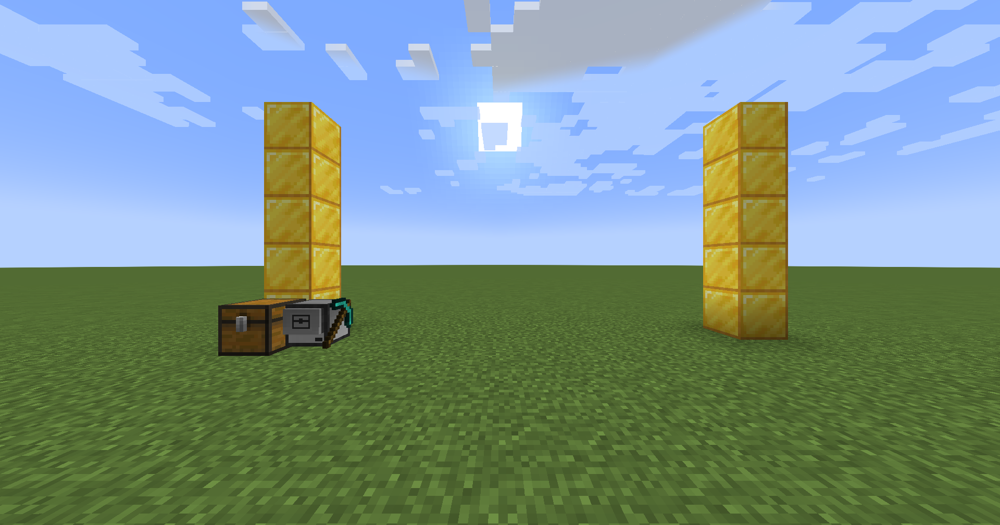
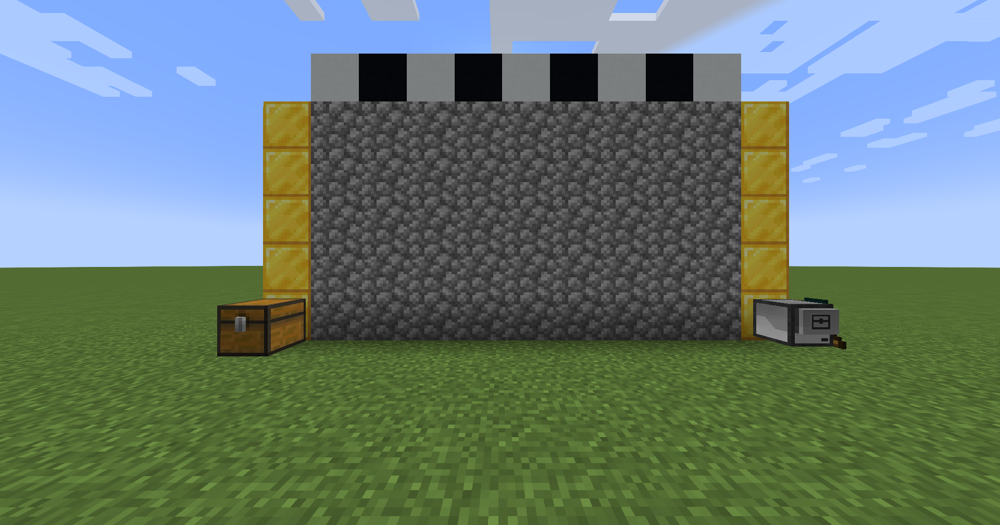

# Wall

Creates a rectangular wall, taking resources from a chest beside it.

## Setup

Note the location of the chest relative to the turtle. The block storage system may be expanded to fit your needs!

This is the result of running `Wall 9 5` on the turtle.

## Wall.lua

Takes in the arguments `width` and `height`, in that order.
Running `Wall 9 5` means the wall will be nine blocks wide and 5 blocks tall.
The pastebin code is `htt4iCN1`.

> [!WARNING]
> If you place any blocks in the turtle's inventory before the program runs, make sure that you fill the slots from the top left to the bottom right.
> This program assumes the inventory is empty aside from the blocks to build with. Make sure the turtle has enough fuel to do the job!
